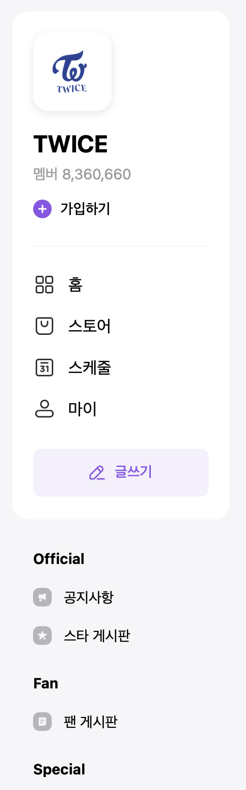
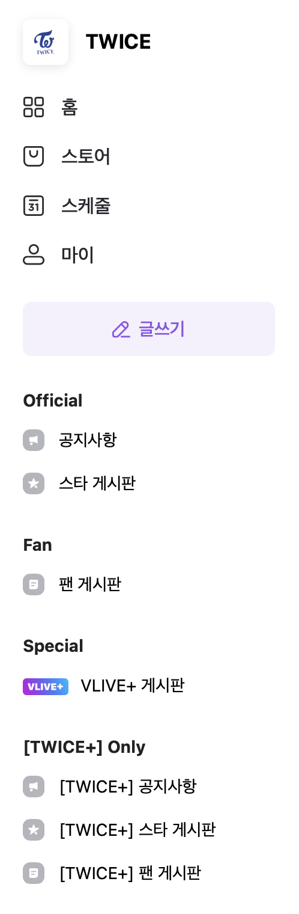
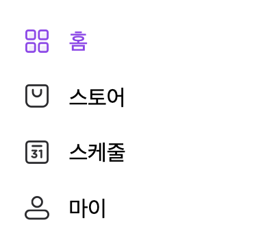
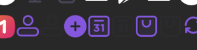
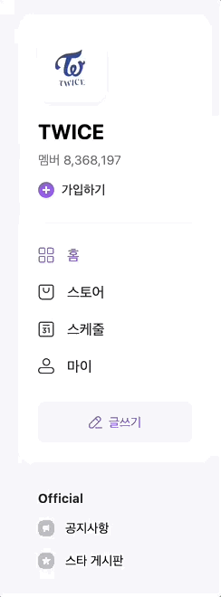
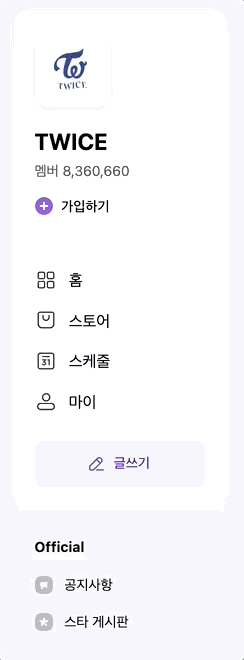
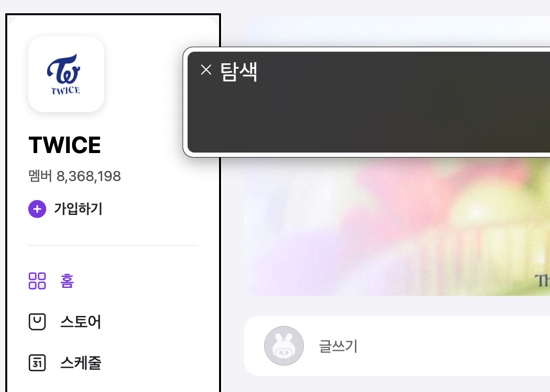
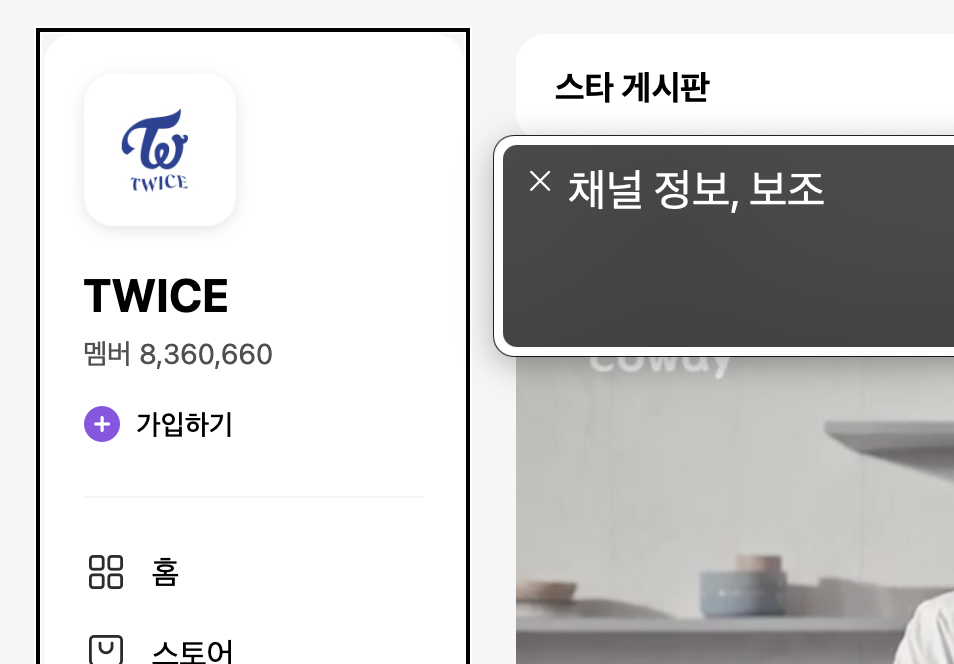
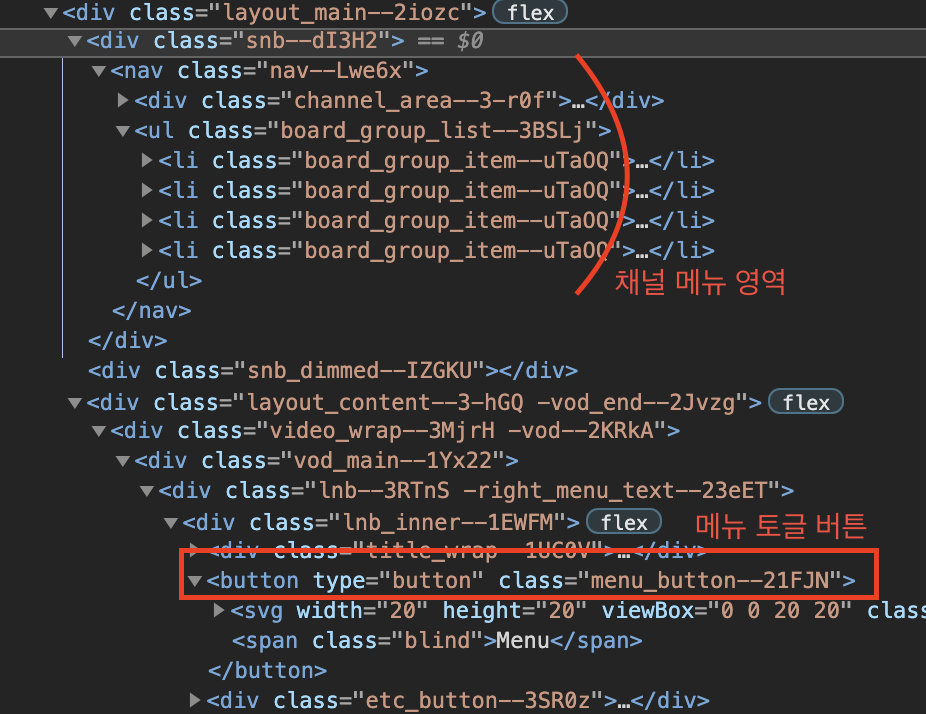

<style>
section {
   font-family: 'Nanum Gothic', sans-serif;
}

code{
   background: #8d54e6;
   padding: 2px 10px;
   border-radius: 5px;
}

pre code{
   color: #eee;
   background: #333;
   border-radius: 10px;
}

pre {
   display: flow-root;
   font-size: 24px;
   line-height: 1.5;
}

h1{
   font-size: 40px;
}

h2{
   font-size: 34px;
}

h3{
   font-size: 27px;
}

h4{
   font-size: 56px;
}

li, p{
   font-size: 24px;
   font-weight: 700;
   line-height: 1.5
}
img{
   border-radius: 10px;

}
img[alt~="center"] {
  display: block;
  margin: 0 auto;
}

img[alt~="left"] {
  float: left;
  margin-right: 20px;
}

img[alt~="right"] {
  float: right;
  margin-left: 20px;
}
</style>

<!-- _class: lead -->

# 채널 정보 파트

### 김정원

---

# 구성

- 데스크톱, 타블렛 뷰포트에선 화면 좌측에 고정
- 모바일 상태에는 버튼으로 호출하는 슬라이딩 메뉴

두 상태를 고려해서 마크업을 진행

---

# HTML



- 모바일일때는 하나의 컨테이너 같지만 데스크톱과 타블렛을 보면 두개의 영역으로 분리되어 있음
- 두가지 상태 모두 표현할 수 있도록 채널 정보만 있는 부분을 한 번 더 컨테이너로 묶어서 진행

---

# SCSS

- 메뉴의 아이콘중 일부가 스프라이트 이미지로 구성. 반복되어 사용될 것을 고려하여 스프라이트 이미지를 보여주는 믹스인을 제작해서 재사용




---

```scss
@mixin spriteIcon($w, $h, $x, $y) {
  display: inline-block;
  vertical-align: middle;
  width: rem($w);
  height: rem($h);
  background-image: url("/src/img/vlive_sprite.png");
  background-size: 538px 518px;
  background-position: ($x * -1) ($y * -1);
}
```

해당 믹스인은 다음과 같이 적용

```scss
//...
@at-root .icon {
    &--plus {
      @include spriteIcon(18px, 18px, 201px, 498px);
      margin-right: rem(5px);
    }
    &--home {
      @include spriteIcon(18px, 18px, 473px, 467px);
      margin-right: rem(10px);
    }
//...
```

---

# SCSS

- 각 스프라이트 아이콘은 버튼이 호버되었을 때 다른 영역을 보여줘야 함
- 이를 일일히 선택자를 사용해 위치를 다시 잡아줄 수도 있었지만 SCSS의 `@each` 반복문을 활용했다.

---

```scss
$icon-list: (
  home: -473px,
  store: -277px,
  schedule: -239px,
  my: -182px,
);

&-link {
  @each $name, $x in $icon-list {
    // 아이콘 이름과 X좌표를 받는다.
    &--#{$name}:hover {
      // 각 이름에 해당하는 링크에 호버시
      color: $primary-color;
      > .icon--#{$name} {
        // 각 이름에 해당하는 아이콘의 속성을 변경한다.
        background-position-x: $x + 19px;
        // 입력받은 x좌표에 19px를 추가
      }
    }
  }
}
```

---

# 접근성



### 포커스와 아웃라인

WCAG 성공기준 "2.4.7 식별 가능한 포커스"에 준하기 위해서는 탭으로 포커스를 할 때 반드시 시각적으로 포커싱 되어있음이 확인되어야 한다.

하지만 중간중간 아웃라인이 보이지 않는 영역과 아웃라인이 잘려 보이는 부분이 존재.

---

# 접근성



### 포커스와 아웃라인

스타일 속성을 통해 포커스시 아웃라인을 지우지 않도록 하여 모든 포커스 아웃라인이 정상 출력되도록 유지 했다.

---

# 접근성

### 영역에 대한 헤딩

WCAG 성공기준 "2.4.10 섹션(section) 헤딩"에 준하기 위해서는 각 콘텐츠의 섹션별로 식별 가능한 이름이 제공되어야 함

하지만 채널 정보에 대한 헤딩이 존재하지 않음



---

# 접근성

### 영역에 대한 헤딩

다음과 같이 섹션의 라벨을 지정해줘서 해결했다.



```html
<!-- ... -->

<aside class="channel" aria-labelledby="channelLabel">
  <div class="channel__container">
    <h2 class="channel__heading a11y-hidden" id="channelLabel">채널 정보</h2>
  </div>
</aside>

<!-- ... -->
```

---

# 접근성

### 모바일 뷰포트 환경

모바일에서 탭을 사용하지 않을거라 생각하겠지만 저시력자들의 경우 화면을 확대하여 사용

WCAG 성공기준 "1.4.10 재배치"에 의거 반응형 사이트의 경우 화면을 확대하여 상대적으로 뷰포트의 사이즈가 줄어들었을 때 스크롤이 생기지 않게하기 위해 모바일 레이아웃으로 페이지를 탐색할 수 있어야 함

---

# 접근성

### 모바일 메뉴버튼 접근

메뉴 토글버튼이 좌측 채널정보보다 뒤에 마크업 되어있고, 채널정보에 포커스가 가능해서 모든 채널 정보를 순회하고 겨우 메뉴를 열 수 있음

- 마크업 구조를 개선하여 버튼을 먼저 배치
- 메뉴가 나타나지 않을 때는 visibility: hidden을 추가하여 포커스되지 않도록 설정

---

# 접근성

### 모바일 메뉴버튼 토글 이후 포커스 문제

메뉴 토글버튼을 포커스하여 메뉴를 열어도 탭을 이용하면 메뉴버튼 아래로 포커스가 이어진다. 메뉴를 열어도 메뉴 안쪽으로 포커스가 어려운 문제가 있다.

"성공기준 2.4.3 포커스 순서"에 준하기 위해서는 이런 문제를 해결해야 한다

---

# 접근성

### 모바일 메뉴버튼 토글 이후 포커스 문제

이 문제는 JS를 사용해야만 해결할 수 있었기 때문에 토글 기능에 다음과 같은 코드를 추가했다.

```js
menuToggle.addEventListener("click", (e) => {
  classToggleHandler(e, menu, "is-active", "on");
  classToggleHandler(e, backdrop, "is-active", "on");
  menu.setAttribute("tabindex", "0");
  // 메뉴가 열리면 탭인덱스 속성을 추가
  menu.setAttribute("role", "dialog");
  // 메뉴가 열리면 role속성으로 dialog를 추가
  menu.setAttribute("aria-labelledby", "channelLabel");
  // dialog의 label을 지정
  menu.focus();
  // tabindex가 지정된 메뉴로 포커스
});
```

---

# 접근성

### 모바일 메뉴버튼 토글 이후 포커스 문제


다음과 같은 순서로 문제를 해결했다.

- 메뉴버튼을 토글하면 메뉴에 탭인덱스 속성을 줘서 포커스 가능하게 설정
- dialog role을 지정 및 label을 지정
- 메뉴가 열리면 바로 menu로 포커스가 가도록 설정

추가로 키보드 인터렉션을 통해 메뉴를 닫을 때 다시 버튼으로 포커스가 갈 수 있도록 설정하여 "3.2.5 요구에 의한 변경"도 충족할 수 있었다.

---

# 결론
