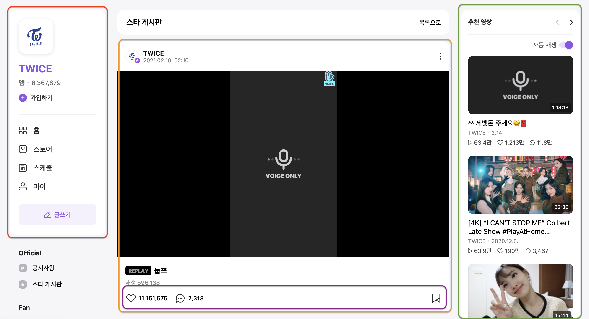
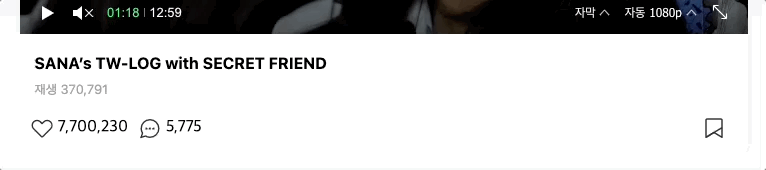
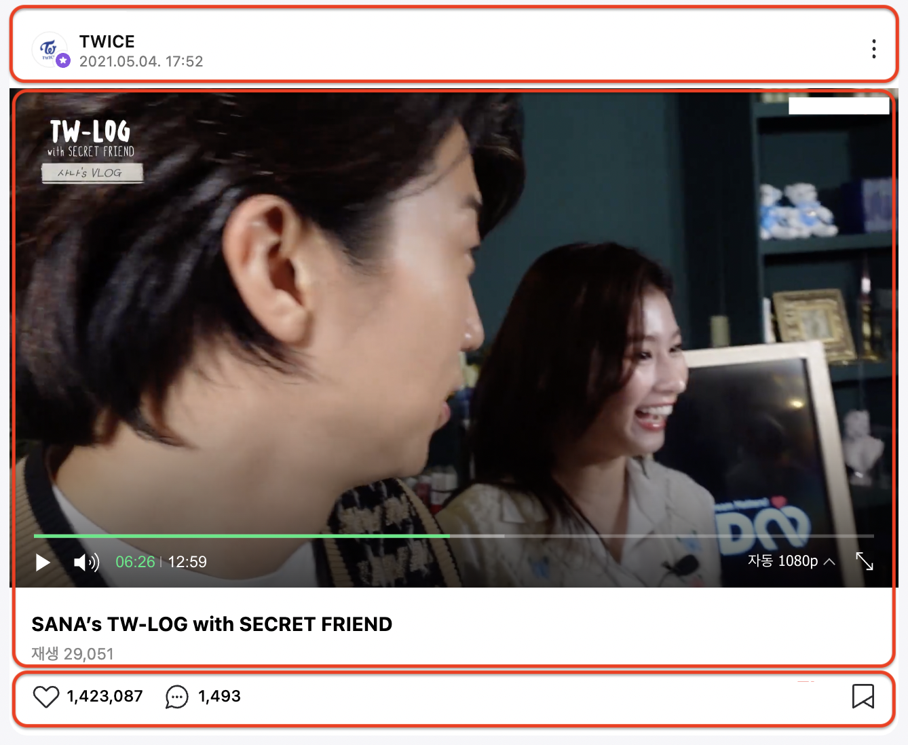
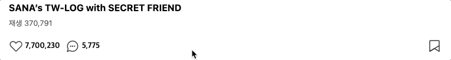
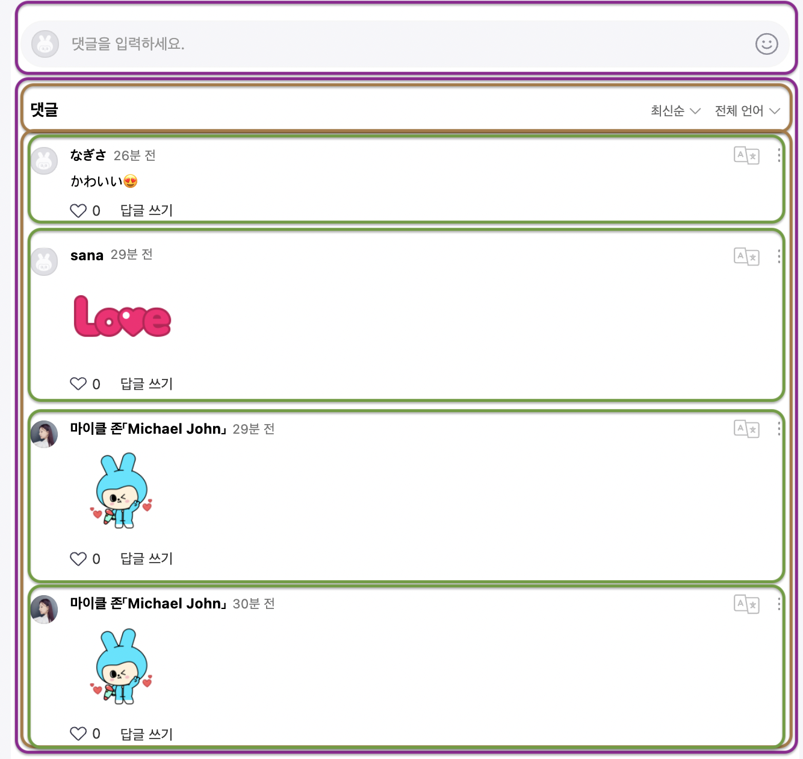
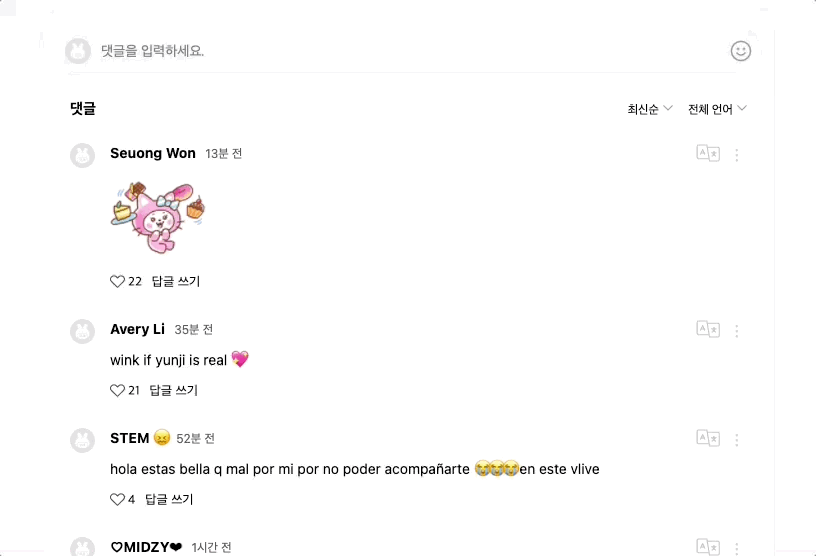
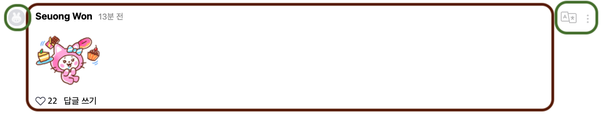

<style>
section {
   font-family: 'Nanum Gothic', sans-serif;
}

code{
   background: #8d54e6;
   padding: 2px 10px;
   border-radius: 5px;
}

pre code{
   color: #eee;
   background: #333;
   border-radius: 10px;
}

h1{
   font-size: 40px;
}

h2{
   font-size: 34px;
}

h3{
   font-size: 27px;
}

h4{
   font-size: 56px;
}

li, p{
   font-size: 24px;
   font-weight: 700;
}
img{
   border-radius: 10px;

}
img[alt~="center"] {
  display: block;
  margin: 0 auto;
}

img[alt~="left"] {
  float: left;
  margin-right: 20px;
}

img[alt~="right"] {
  float: right;
  margin-left: 20px;
}
</style>

#### VLIVE


## 웹표준과 접근성을 중심으로

성수동 비타민 - 김영종, 김정원, 정두영

---

# 목차

1. 개요
   1.1 기획
   1.2 개발 환경
2. VLIVE 페이지 분석
   2.1 마크업 & 스타일
   2.2 웹준과 접근성
3. 프로젝트
   3.1 마크업 구조
   3.2 결과 및 시연
4. 이슈
   4.1 접근성 이슈
   4.2
5. 결론

---

# 누구누구

---

# 문제점

1. layout 구성시 `float` 속성을 사용하지 않고 `grid`를 선택한 이유
1. IE 에서 `is-fixed` 가 제대로 동작하지 않은 이유
1. Safari mobile 환경에서 댓글창 크기가 제대로 동작하지 않음

---

# 접근성 관련 이슈

1. sliding menu 내에서 닫기 버튼의 부재
2. tab index의 불합리성

---

# 접근성 향상 사례

## 1. Tab navigation



- 주황색 다음 영역 선택 불가능
- _비디오(주황색)_
- _채널(빨강)_
- _추천 영상(초록)_

---

# 접근성 향상 사례

## 1. Tab navigation



Video Container의 탐색이 끝난 후 채널로 갈지, 추천 영상으로 갈지 선택 가능

---

# Video



## 비디오 부분 마크업

- header 부분

- video 부분(video content와 video detail)

- 하트와 댓글을 남길 수 있는 video post 부분

나중에 `video__header` 와 `video__content` 를  
상단에 sticky 하도록 구현

---


# Video

## 비디오 부분 디자인

### 논리적인 흐름:

1. 동영상 info를 동영상 player보다 먼저 마크업

2. 사용자가 직접 순서를 선택

   2.1 채널 보기
   2.2 추천 영상 보기


---



# Video

## 비디오 부분 디자인

### Sticky

- sticky가 적용된 상태로 아래에 있는 댓글을 읽을 수 없음.
- 동적으로 `is-fixed` 클래스 부여해 `position: fixed` 처리

### Issue

- 목표: `video__header` 와 `video__content` 상단 sticky
- IE 호환성 문제

---

# Video

## 비디오 부분 디자인

### IE 호환성 문제

```scss
&__content {
  @include sticky {        // 미디어 쿼리
    &.is-fixed {           // 동적인 클래스 추가
      position: fixed;     // 위 두가지가 한번에 주어졌을 때 IE에서 이를 인식하지 못함
      top: 114px;
      width: 100%;
      z-index: 2;
    }
  }
```


---

# Video

## 비디오 부분 디자인

### IE 호환성 문제

```scss
&__content {
  &.is-fixed {
    position: fixed; // 이렇게 미디어 쿼리를 제거해주고,
    top: 114px; // 그 대신에 javaScript로 미디어 쿼리 조건을 체크해줌
    width: 100%;
    z-index: 2;
  }
}
```

---



# Comments

## 댓글 부분 마크업

- 댓글을 다는 `form`

- 작성된 댓글들을 확인할 수 있는 `comments__container`

- 각각의 댓글들

---




# Comments

## 댓글 부분 마크업

### 논리적인 구조 - Tab

1. 댓글 입려칸(입력칸 -> 이모티콘  
   -> 취소 -> 등록)
2. 최신순(정렬) -> 전체 언어 (언어
   설정)
3. 언어 설정 -> 더보기
4. 댓글들(작성자 ->
   좋아요 -> 답글 쓰기)

댓글: 좌, 우 `position: absolute`

---

# Comments

## 댓글 부분 스타일링

### 원본


- `fieldset` 에 애니메이션을 적용
  (`focus-within`)
- 사용자가 댓글을 입력하고자 할 때 댓글 입력창을 유동적으로 변경

---

# Comments

## 댓글 부분 스타일링


<br>

### focus-within

- `comments__field` 에 `height`, `border`, `background` 변화
- 댓글창 우측의 아이콘 `display: none;`
- 아래 버튼 3개 `display: block;`

---

- 두영: safari 댓글창 width
  - critical mistake: restore .
