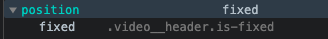
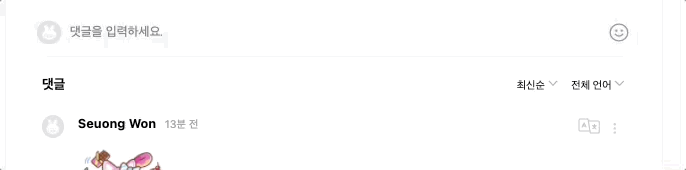
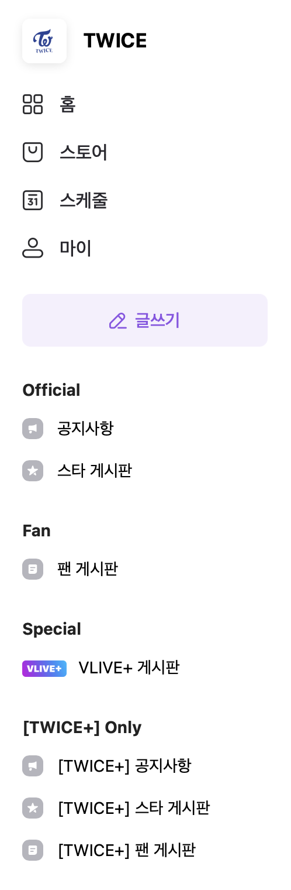
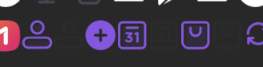
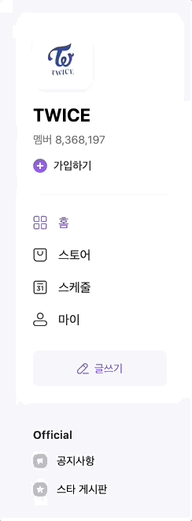
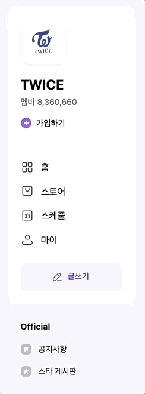
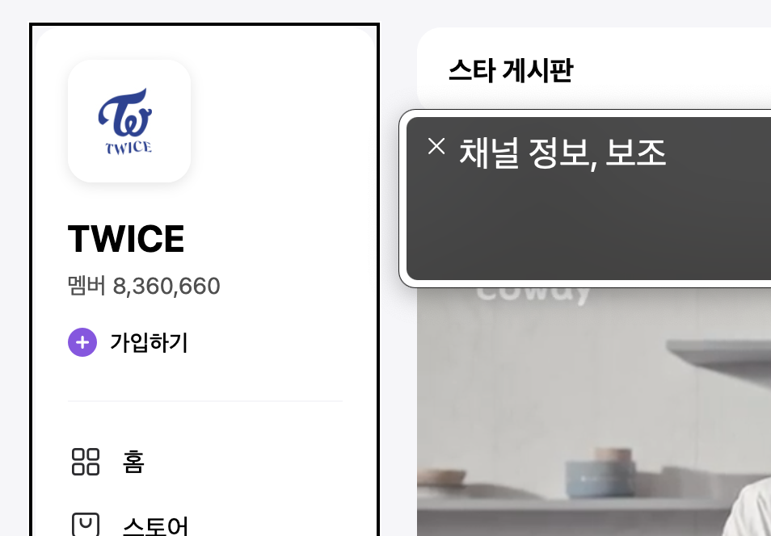
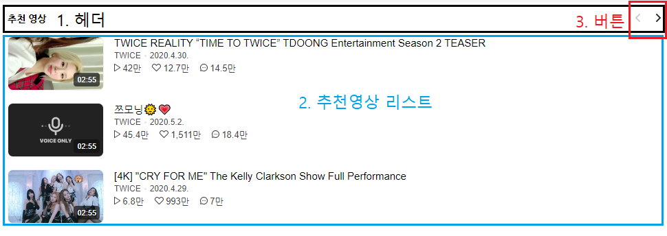

<style>
section {
   font-family: 'Nanum Gothic', sans-serif;
   word-break: keep-all;
}

code{
   background: #8d54e6;
   padding: 2px 10px;
   border-radius: 5px;
}

pre code{
   color: #eee;
   background: #333;
   border-radius: 10px;
}

pre {
  display: flow-root;
   font-size: 24px;
   line-height: 1.5;
}

h1{
   font-size: 40px;
}

h2{
   font-size: 34px;
}

h3{
   font-size: 27px;
}

h4{
   font-size: 56px;
}

li, p{
   font-size: 24px;
   font-weight: 700;
   line-height: 1.5
}
img{
   border-radius: 10px;

}
img[alt~="center"] {
  display: block;
  margin: 0 auto;
}

img[alt~="left"] {
  float: left;
  margin-right: 20px;
}

img[alt~="right"] {
  float: right;
  margin-left: 20px;
}
</style>

#### VLIVE


## 웹표준과 접근성을 중심으로

성수동 비타민 - 김영종, 김정원, 정두영

---

# 목차

1. 개요
   1. 구성
   2. 기획
2. 설계
   1. 마크업 & 스타일
   2. 웹표준과 접근성
3. 개발
   1. 개발 환경
   2. 메인 비디오 - 정두영
   3. 좌측 채널정보 - 김정원
   4. 우측 추천영상 - 김영종
4. 결론과 느낀점

---

<!-- _class: lead -->

# 완성 페이지 접속 링크

#### https://bit.ly/3vMnOe3

---

<!-- _class: lead -->

#### 개요

---

# 개요


V LIVE 사이트를 클론코딩 하기로 선정.

V LIVE는 K-POP STAR들의 라이브 방송을 송출해 주는 서비스로 최근 K-POP의 열풍 덕분에 글로벌 트래픽 증가

하지만 글로벌하게 서비스함에도 접근성에 대해 아쉬운 부분이 존재.

기존 VLIVE의 LightHouse 점수


---

# 개요


마크업 설계부터 접근성을 고려하여 사이트를 재설계

새롭게 만든 VLIVE의 LightHouse 점수
(동영상을 IFRAME으로 삽입하여 만점을 받지는 못했다.)


---

# 개요 - 구성

페이지의 구성은 크게 3단으로 되어있으며 데스크탑, 타블렛, 모바일에 따라 레이아웃이 달라진다.


---

<!-- _class: lead -->

#### 설계

---

# 마크업

반응형 레이아웃을 위한 설계 방법을 고민

- float를 통한 레이아웃 구성
- flex를 통한 레이아웃 구성
- grid를 통한 레이아웃 구성

다양한 의견을 팀원들과 이야기하여 grid를 통해 레이아웃을 구성하면 적합하다고 판단하여 그리드를 사용

---


# 마크업

## grid 코드

---

# SCSS

공통적으로 사용되는 스타일과 컴포넌트는 믹스인을 미리 설계하여 팀원들과 함께 사용했다.

## 박스 믹스인

```scss
@mixin box($color: $white, $width: auto) {
  background-color: $color;
  width: $width;
  @include desktop {
    border-radius: 15px;
  }
}
```

---

## 버튼 믹스인

```scss
@mixin buttonBox($isCircle: false, $size: rem(30px), $bg: transparent) {
  margin: 0;
  padding: 0;
  border: none;
  border-radius: rem(8px);
  appearance: none;
  background: none;
  cursor: pointer;
  background-color: $bg;
  @if $isCircle {
    width: $size;
    height: $size;
    border-radius: 50%;
  }
  &:hover {
    background-color: mix($bg, rgba(0, 0, 0, 0.15));
  }
}
```

---

## 접근성

- 접근성을 고려해 설계해야 하기 때문에 레이아웃부터 논리적인 순서를 고려해 마크업했다.

- 보이는 순서는 GRID를 통해 정렬되기 때문에 논리적인 마크업에 집중할 수 있었다.

---

# 레이아웃 순서


---

## 문제점 1

- 탭을 통해 이동시 동영상 섹션을 모두 탐색해야 이동할 수 있는데, 그러기에는 댓글이 너무많다!

  - 동영상 섹션 마지막에 포커싱을 이동할 수 있도록 기능을 추가하여 해결
  - 자세한 내용은 개발 파트에서 설명

---

## 문제점 2


- 모바일 환경에서는 메뉴에 탭 접근이 엉망..
  - 자바스크립트를 통해 해결
  - 자세한 내용은 개발 파트에서 설명

---

<!-- _class: lead -->

#### 개발

---


# 개발 환경 / 사용 기술

- Yarn
- Parcel
  
- SCSS(SASS)
  
- PostCSS
  - autoprefixer
  - postcss-combine-media-query
- Prettier
  

---

<!-- _class: lead -->

# 메인 비디오, 댓글 파트

### 정두영

---


# 비디오 부분 마크업 & 디자인

- header 부분

- video 부분(video content와 video detail)

- 하트와 댓글을 남길 수 있는 video post 부분

## content와 video post ?

나중에 `video__header` 와 `video__content` 를  
상단에 sticky 하도록 구현

---


# 비디오 부분 마크업 & 디자인

### Sticky...?


`video__header` -> position: sticky;
`video__content` -> position: sticky;

---


## 비디오 부분 마크업 & 디자인

<br>

### Sticky 문제점

- 원하는대로 동작하지 않음
- sticky가 적용된 상태로 아래에 있는 댓글을 읽을 수 없음

<br>

## Why?

---


# 비디오 부분 디자인

### CodePen 실험


- `position: sticky`는 부모 컨테이너  
  내부에서만 동작
- 따라서 원하던 기능을 구현할 수 없음

---


# 비디오 부분 디자인

### 해결 방안

- javascript로 `is-fixed` 클래스를 동적으로 부여

- `is-fixed` 일 때 `position: fixed`

### 하지만 ...

- IE 호환성 문제



---

## 비디오 부분 디자인

### IE 호환성 문제

```scss
&__content {
  // 미디어 쿼리, 동적인 클래스 추가
  @include sticky {
    &.is-fixed {
      position: fixed; // 위 두가지가 한번에 주어졌을 때 IE에서 이를 인식하지 못하는 문제 발생
      ...
    }
  }
}
```

---

## 비디오 부분 디자인

### IE 호환성 문제 - 코드 수정

<br>

```scss
&__content {
  &.is-fixed {
    position: fixed; // 이렇게 미디어 쿼리를 제거해주고,
    ...              // 그 대신에 javaScript로 미디어 쿼리 조건을 체크해줌
  }
}
```

---


## 비디오 부분 디자인

<br>

### 해결 결과

- 미디어 쿼리 대신 javaScript `window.innerWidth`사용
- 동적으로 `is-fixed` 클래스를 부여해 `position: fixed`

---

## 비디오 부분 접근성


### 논리적인 흐름:

- 동영상 정보를 동영상 플레이어보다 먼저 마크업

- 스크린 리더 고려

- 탭의 자연스러운 이동

---


## 비디오 부분 접근성

### 탭 아웃라인의 부재:

- 채널 아바타부터 시작해 탭을 누르고 있지만  
  탭이 어디 위치하고 있는지 전혀 알 수 없음

- 그러다가 갑자기 추천영상으로 탭이가서 혼란스러움

<!-- 2. 사용자가 직접 순서를 선택

   2.1 채널 보기
   2.2 추천 영상 보기 -->

<!--  -->

---


## 비디오 부분 접근성

### 접근성 향상 결과:

- 채널 아바타부터 시작해 탭을 누를 때, 탭이 어디에 위치해 있는지 명확하게 보여줌

- 그 다음으로 어디를 탐색하고 싶은지 정할 수 있도록 함
  - 디폴트는 댓글 쓰는 입력칸으로 tab 이동

---

## 비디오 부분 접근성

### 접근성 향상 결과: 추가적인 탭 탐색 기능 구현

1. 채널 보기
2. 추천 동영상 보기


---

## 비디오 부분 접근성

### 명도 대비


명도 대비가 AA 기준을 만족하지 못하고 있다.

---

## 비디오 부분 접근성

### 명도 대비


명도 대비를 확실하게 차이를 주어서 접근성을 향상시킴

---


# Comments

## 댓글 부분 마크업 & 디자인

- 댓글을 다는 `form`

- 작성된 댓글들을 확인할 수 있는 `comments__container`

- 각각의 댓글들

   <br>

  댓글: 좌, 우 `position: absolute`

  

---

# Comments

## 댓글 부분 마크업 & 디자인

### 원본


- `fieldset` 에 애니메이션을 적용
  (`focus-within`)
- 사용자가 댓글을 입력하고자 할 때 댓글 입력창을 유동적으로 변경

---

# Comments

## 댓글 부분 마크업 & 디자인

### 결과



- `focus-within`

---


# Comments

## 댓글 부분 접근성

### 탭의 불합리성

- 댓글 입력칸부터 차례대로 tab

- 탭 아웃라인이 중간중간 제대로 보이지 않음

- 탭의 순서: 아바타, 작성자, 좋아요, 답글 쓰기, 언어 설정, 더보기

---

# Comments


## 댓글 부분 접근성

### 논리적인 구조

- 댓글 입력칸부터 차례대로 tab

- 탭의 아웃라인을 확실히 보여줌

- 탭의 순서

  1.  댓글 입려칸(입력칸 ->  
      이모티콘 -> 취소 -> 등록)

  2.  최신순(정렬) -> 전체 언어

  3.  언어 설정 -> 더보기

  4.  댓글들(작성자 ->
      좋아요 -> 답글 쓰기)

---

<!-- _class: lead -->

# 채널 정보 파트

### 김정원

---

# 구성

- 데스크톱, 타블렛 뷰포트에선 화면 좌측에 고정
- 모바일 상태에는 버튼으로 호출하는 슬라이딩 메뉴

두 상태를 고려해서 마크업을 진행

---

# HTML



- 모바일일때는 하나의 컨테이너 같지만 데스크톱과 타블렛을 보면 두개의 영역으로 분리되어 있음
- 두가지 상태 모두 표현할 수 있도록 채널 정보만 있는 부분을 한 번 더 컨테이너로 묶어서 진행

---

# SCSS

- 메뉴의 아이콘중 일부가 스프라이트 이미지로 구성. 반복되어 사용될 것을 고려하여 스프라이트 이미지를 보여주는 믹스인을 제작해서 재사용




---

```scss
@mixin spriteIcon($w, $h, $x, $y) {
  display: inline-block;
  vertical-align: middle;
  width: rem($w);
  height: rem($h);
  background-image: url("/src/img/vlive_sprite.png");
  background-size: 538px 518px;
  background-position: ($x * -1) ($y * -1);
}
```

해당 믹스인은 다음과 같이 적용

```scss
//...
@at-root .icon {
    &--plus {
      @include spriteIcon(18px, 18px, 201px, 498px);
      margin-right: rem(5px);
    }
    &--home {
      @include spriteIcon(18px, 18px, 473px, 467px);
      margin-right: rem(10px);
    }
//...
```

---

# SCSS

- 각 스프라이트 아이콘은 버튼이 호버되었을 때 다른 영역을 보여줘야 함
- 이를 일일히 선택자를 사용해 위치를 다시 잡아줄 수도 있었지만 SCSS의 `@each` 반복문을 활용했다.

---

```scss
$icon-list: (
  home: -473px,
  store: -277px,
  schedule: -239px,
  my: -182px,
);

&-link {
  @each $name, $x in $icon-list {
    // 아이콘 이름과 X좌표를 받는다.
    &--#{$name}:hover {
      // 각 이름에 해당하는 링크에 호버시
      color: $primary-color;
      > .icon--#{$name} {
        // 각 이름에 해당하는 아이콘의 속성을 변경한다.
        background-position-x: $x + 19px;
        // 입력받은 x좌표에 19px를 추가
      }
    }
  }
}
```

---

# 접근성



### 포커스와 아웃라인

WCAG 성공기준 "2.4.7 식별 가능한 포커스"에 준하기 위해서는 탭으로 포커스를 할 때 반드시 시각적으로 포커싱 되어있음이 확인되어야 한다.

하지만 중간중간 아웃라인이 보이지 않는 영역과 아웃라인이 잘려 보이는 부분이 존재.

---

# 접근성



### 포커스와 아웃라인

스타일 속성을 통해 포커스시 아웃라인을 지우지 않도록 하여 모든 포커스 아웃라인이 정상 출력되도록 유지 했다.

---

# 접근성

### 영역에 대한 헤딩

WCAG 성공기준 "2.4.10 섹션(section) 헤딩"에 준하기 위해서는 각 콘텐츠의 섹션별로 식별 가능한 이름이 제공되어야 함

하지만 채널 정보에 대한 헤딩이 존재하지 않음


---

# 접근성

### 영역에 대한 헤딩

다음과 같이 섹션의 라벨을 지정해줘서 해결했다.



```html
<!-- ... -->

<aside class="channel" aria-labelledby="channelLabel">
  <div class="channel__container">
    <h2 class="channel__heading a11y-hidden" id="channelLabel">채널 정보</h2>
  </div>
</aside>

<!-- ... -->
```

---

# 접근성

### 모바일 뷰포트 환경

모바일에서 탭을 사용하지 않을거라 생각하겠지만 저시력자들의 경우 화면을 확대하여 사용

WCAG 성공기준 "1.4.10 재배치"에 의거 반응형 사이트의 경우 화면을 확대하여 상대적으로 뷰포트의 사이즈가 줄어들었을 때 스크롤이 생기지 않게하기 위해 모바일 레이아웃으로 페이지를 탐색할 수 있어야 함

---

# 접근성

### 모바일 메뉴버튼 접근

메뉴 토글버튼이 좌측 채널정보보다 뒤에 마크업 되어있고, 채널정보에 포커스가 가능해서 모든 채널 정보를 순회하고 겨우 메뉴를 열 수 있음

- 마크업 구조를 개선하여 버튼을 먼저 배치
- 메뉴가 나타나지 않을 때는 visibility: hidden을 추가하여 포커스되지 않도록 설정

---

# 접근성

### 모바일 메뉴버튼 토글 이후 포커스 문제

 메뉴 토글버튼을 포커스하여 메뉴를 열어도 탭을 이용하면 메뉴버튼 아래로 포커스가 이어진다. 메뉴를 열어도 메뉴 안쪽으로 포커스가 어려운 문제가 있다.

"성공기준 2.4.3 포커스 순서"에 준하기 위해서는 이런 문제를 해결해야 한다

---

# 접근성

### 모바일 메뉴버튼 토글 이후 포커스 문제

이 문제는 JS를 사용해야만 해결할 수 있었기 때문에 토글 기능에 다음과 같은 코드를 추가했다.

```js
menuToggle.addEventListener("click", (e) => {
  classToggleHandler(e, menu, "is-active", "on");
  classToggleHandler(e, backdrop, "is-active", "on");
  menu.setAttribute("tabindex", "0");
  // 메뉴가 열리면 탭인덱스 속성을 추가
  menu.setAttribute("role", "dialog");
  // 메뉴가 열리면 role속성으로 dialog를 추가
  menu.setAttribute("aria-labelledby", "channelLabel");
  // dialog의 label을 지정
  menu.focus();
  // tabindex가 지정된 메뉴로 포커스
});
```

---

# 접근성

### 모바일 메뉴버튼 토글 이후 포커스 문제


다음과 같은 순서로 문제를 해결했다.

- 메뉴버튼을 토글하면 메뉴에 탭인덱스 속성을 줘서 포커스 가능하게 설정
- dialog role을 지정 및 label을 지정
- 메뉴가 열리면 바로 menu로 포커스가 가도록 설정

추가로 키보드 인터렉션을 통해 메뉴를 닫을 때 다시 버튼으로 포커스가 갈 수 있도록 설정하여 "3.2.5 요구에 의한 변경"도 충족할 수 있었다.

---

# 결론

---

<!-- _class: lead -->

# 추천영상 파트

### 김영종

---

# 마크업

- 디바이스의 크기에 따라 추천영상의 레이아웃이 변화되는 `적응형` 디자인 패턴을 사용됐다.

  

---

# 마크업

- 정보가 쌓이는 방향
  

---

- 논리적으로 배치 되었는가?
  - 일반적으로 리스트에 포함된 영상을 본 후에 보고싶은 영상이 없다면 다음 리스트를 보여준다.
  - 영상 정보는 제목이 가장 중요하기 때문에 제목(부가정보), 썸네일 순으로 배치

<!-- ### 기존 마크업 순서


1. 헤더
2. 버튼
3. 추천 영상 리스트

---

### 수정된 마크업 순서



1. 헤더
2. 추천 영상 리스트
3. 버튼

--- -->

---

# 스타일

1. 영상이 쌓이는 방향

- 모바일, 데스크탑: 영상이 수직 방향으로 쌓인다.
- 테블릿: 영상이 수평 방향으로 쌓인다.

2. 썸네일과 부가정보의 배치

- 테블릿, 데스크탑: 썸네일이 상단에, 부가정보는 하단에 배치된다.
- 모바일: 썸네일이 왼쪽에, 부가정보는 오른쪽에 배치된다.

3. 부가정보가 배치되는 순서

- 수직 방향으로 쌓인다.

---

> 참고: flex 속성을 사용하면 인라인, 블록 요소에 상관없이 쌓이는 흐름을 제어할 수 있다.

<!-- _class: lead -->


---

# 접근성

1. 부분 포커스 아웃라인
   기존 사이트: 자동 재생 버튼에 아웃라인이 적용되어 있지 않음
   - 접근성을 고려한다면 탭을 통해서만 포커스가 가도록 만들어야 한다.


