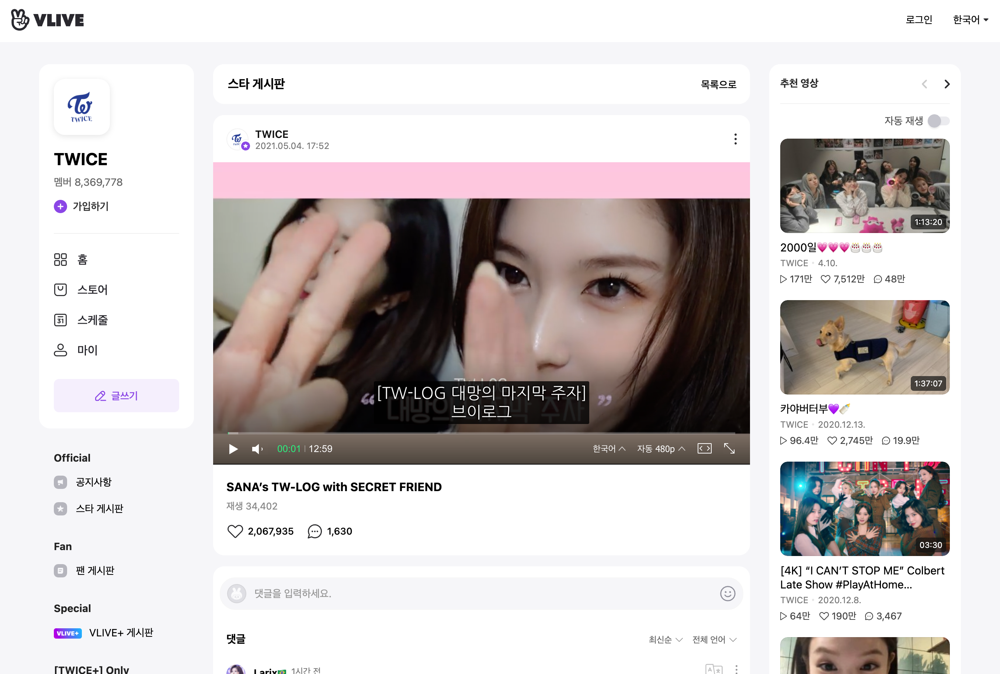
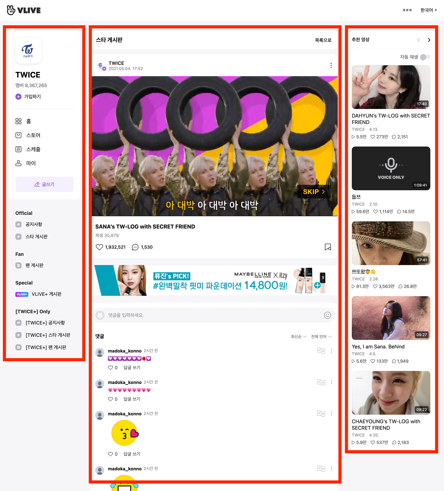
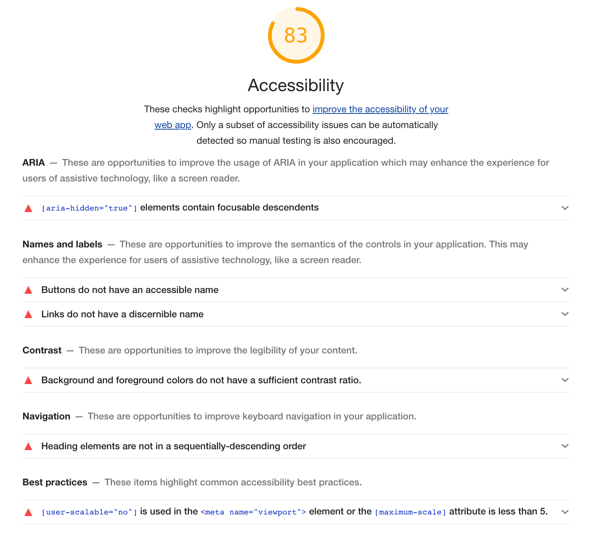
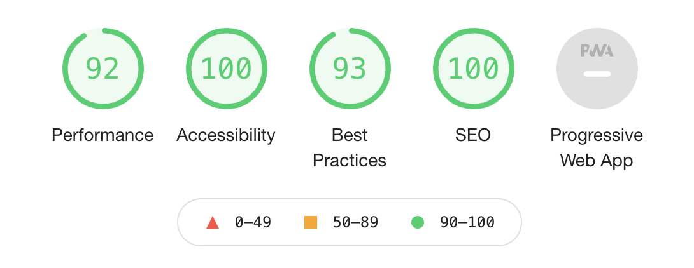
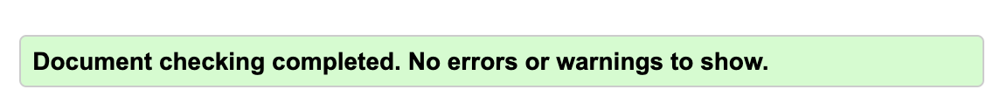

# 성수동 비타민(1조) 팀 프로젝트

## 기획



우리는 클론프로젝트를 진행할 사이트로 VLIVE 페이지를 선정했다. 이유는 VLIVE는 요즘 KPOP의 기류에 맞춰 굉장히 글로벌한 이용자를 가지고 있는 사이트임에도 접근성 측면에서(특히 탭 순서와 관련하여) 아쉬운 부분이 있었기 때문이다. 또한 HTML/CSS 기술 측면에서도 지금까지 배운 기술들을 다양하게 활용할 수 있는 컴포넌트들을 갖고 있었다.

## 사용 기술

기본적으로 패키지 매니저는 Yarn을 사용했다. NPM에 비하여 속도나 안정성 측면에서 더 효율적이라고 알려져 있다. 꼭 NPM을 사용해야하는 제한이 없는 이상 장점이 더 많은 Yarn을 사용하는 게 좋다고 생각했다.

CSS 전처리에는 SCSS(SASS), 후처리에는 PostCSS의 autoprefixer, postcss-combine-media-query 플러그인을 사용했다. SCSS의 믹스인과 함수를 미리 팀원들과 이야기해서 정의하고 필요한 곳에서 활용하여 스타일의 통일성을 증가시켜주고 생산성도 높일 수 있었다.

적지만 자바스크립트도 사용했다. 나 같은 경우에는 ES6문법에 익숙했기 때문에 Babel을 사용해야만 했다.

그리고 이 모든 처리를 일괄적으로 해줄 번들러로는 Parcel을 선택했다. Webpack을 사용하기에는 프로젝트의 규모가 작고 아직 활용법을 자세히 몰라 간단한 설정으로 번들링이 가능한 Parcel을 사용했다.

## HTML

데스크톱 레이아웃은 다음과 같다

평범한 3단 구조 레이아웃이기 때문에 Flex를 사용해서 배치해도 될 것 같지만, 디바이스가 달라지면 다음과 같이 변한다.


구조가 변하면서 우측에 있던 추천 영상이 영상과 댓글 사이로 이동한다. 이런 구현은 flex만으로는 어렵다고 판단했다.

그래서 나온 방법이 추천영상 부분을 Desktop 상태일 때만 float:right를 이용해서 오른쪽으로 뽑아내는 방법이었다. 하지만 팀원 중 한명이 적극적으로 레이아웃 구성에 float를 사용하는 것을 지양하자는 주장을 했었고, grid 레이아웃을 사용하는 것이 더 바람직하다는 의견이 통일되어 grid 레이아웃을 통해 레이아웃을 구성하기로 했다.

그렇게 작성한 그리드 레이아웃은 아래와 같다

```scss
.grid_wrapper {
  display: grid;
  width: 100%;
  margin: 0 auto;
  grid-template:
    "board" 50px
    "video" auto
    "related" auto
    "comments" auto
    / 100%;
  gap: 10px;

  @include desktop {
    width: 1250px;
    margin-top: rem(30px);
    margin-bottom: rem(40px);
    grid-template:
      "channel board related" 54px
      "channel video related" auto
      "channel comments related" auto
      / 210px 1fr 260px;
    gap: 15px 26px;
  }
  @include tablet {
    width: 964px;
    grid-template:
      "channel board" 54px
      "channel video" auto
      "channel related" auto
      "channel comments" auto
      / 210px 1fr;
    gap: 15px 26px;
  }
}
```

Mobile-first 방식으로 미디어쿼리를 구성했기 때문에 기본적으로 행으로 쌓아 배치되다가 타블렛일 때, 데스크탑일 때 단계별로 변할 수 있도록 배치하였다.

## SCSS

공용으로 사용하는 `a11y-hidden` 클래스, 박스와 버튼에 사용되는 믹스인, 그리고 색상값 변수들을 미리 생성하여 작업하였다.

또한 각자 BEM 컨벤션을 지키며 클래스 네이밍을 진행했다.

## JS

아주 기본적인 기능만 메뉴 토글, sticky 기능을 IE에서 사용하기 위해 사용되었다.

## 접근성

먼저 VLIVE 사이트의 접근성 점수를 LightHouse에서 확인 해 보니 다음과 같은 점수가 나왔다.


하나씩 문제를 살펴보면

1. `aria-hidden` 속성을 포커스가 가능한 요소에 넣지 말아야 한다.
2. 버튼에 인식 가능한 텍스트가 존재하지 않는다.
   - `aria-label`로 해결할 수 있다.
3. 링크에 인식 가능한 텍스트가 존재하지 않는다.
   - `aria-label`로 해결할 수 있다.
4. 순서에 맞지 않는 헤딩이 설정되어 있다.
5. 뷰포트 메타태그에 `user-scalable="no"`이 지정되어 있다.
   WCAG 성공기준 1.4.4, 1.4.10의 기준에 부적합하다.

위 문제는 처음 마크업을 할 때부터 접근성을 고려한다면 자연스럽게 해결 될 문제들이나 이 외에도 탭을 활용해 페이지를 탐색 할 때 원하는 위치까지 너무 많은 탭이 필요한 등 LightHouse와는 별개로 실제 사용을 하면서 발견한 문제점들을 각자 파트에서 찾아서 개선하기로 했다.

- [메인 비디오, 댓글 창 - 정두영](./dy.md)

- [좌측 채널정보, 토글 메뉴 - 김정원](./jw.md)

- [추천 영상 - 김영종](./yj-readme.md)

최종적으로 다음과 같은 LightHouse 점수를 받을 수 있었다.



- iframe 태그를 사용해서 아쉽게도 만점을 받지는 못했다.

또한 HTML 문법검사도 문제없이 통과할 수 있었다.


