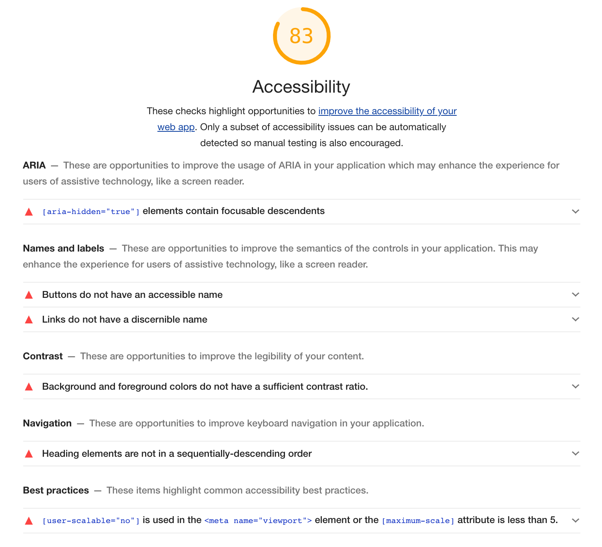
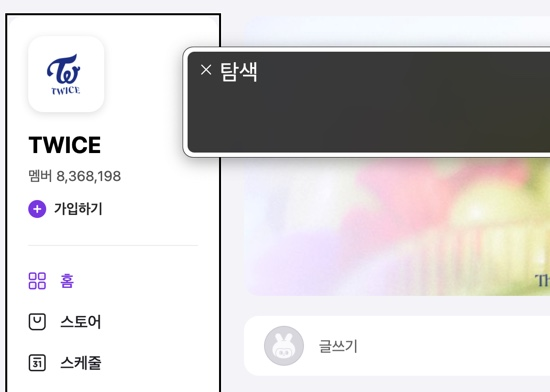

# 성수동 비타민(1조) 팀 프로젝트

## 기획

우리는 클론프로젝트를 진행할 사이트로 VLIVE 페이지를 선정했다. 이유는 VLIVE는 요즘 KPOP의 기류에 맞춰 굉장히 글로벌한 이용자를 가지고 있는 사이트임에도 접근성 측면에서(특히 탭 순서와 관련하여) 아쉬운 부분이 있었기 때문이다. 또한 HTML/CSS 기술 측면에서도 지금까지 배운 기술들을 다양하게 활용할 수 있는 컴포넌트들을 갖고 있었다.

## 사용 기술

기본적으로 패키지 매니저는 Yarn을 사용했다. NPM에 비하여 속도나 안정성 측면에서 더 효율적이라고 알려져 있다. 꼭 NPM을 사용해야하는 제한이 없는 이상 장점이 더 많은 Yarn을 사용하는 게 좋다고 생각했다.

CSS 전처리에는 SCSS(SASS), 후처리에는 PostCSS의 autoprefixer, postcss-combine-media-query 플러그인을 사용했다. SCSS의 믹스인과 함수를 미리 팀원들과 이야기해서 정의하고 필요한 곳에서 활용하여 스타일의 통일성을 증가시켜주고 생산성도 높일 수 있었다.

적지만 자바스크립트도 사용했다. 나 같은 경우에는 ES6문법에 익숙했기 때문에 Babel을 사용해야만 했다.

그리고 이 모든 처리를 일괄적으로 해줄 번들러로는 Parcel을 선택했다. Webpack을 사용하기에는 프로젝트의 규모가 작고 아직 활용법을 자세히 몰라 간단한 설정으로 번들링이 가능한 Parcel을 사용했다.

## HTML

데스크톱 레이아웃은 다음과 같다

평범한 3단 구조 레이아웃이기 때문에 Flex를 사용해서 배치해도 될 것 같지만, 디바이스가 달라지면 다음과 같이 변한다.


구조가 변하면서 우측에 있던 추천 영상이 영상과 댓글 사이로 이동한다. 이런 구현은 flex만으로는 어렵다고 판단했다.

그래서 나온 방법이 추천영상 부분을 Desktop 상태일 때만 float:right를 이용해서 오른쪽으로 뽑아내는 방법이었다. 하지만 팀원 중 한명이 적극적으로 레이아웃 구성에 float를 사용하는 것을 지양하자는 주장을 했었고, grid 레이아웃을 사용하는 것이 더 바람직하다는 의견이 통일되어 grid 레이아웃을 통해 레이아웃을 구성하기로 했다.

그렇게 작성한 그리드 레이아웃은 아래와 같다

```scss
.grid_wrapper {
  display: grid;
  width: 100%;
  margin: 0 auto;
  grid-template:
    "board" 50px
    "video" auto
    "related" auto
    "comments" auto
    / 100%;
  gap: 10px;

  @include desktop {
    width: 1250px;
    margin-top: rem(30px);
    margin-bottom: rem(40px);
    grid-template:
      "channel board related" 54px
      "channel video related" auto
      "channel comments related" auto
      / 210px 1fr 260px;
    gap: 15px 26px;
  }
  @include tablet {
    width: 964px;
    grid-template:
      "channel board" 54px
      "channel video" auto
      "channel related" auto
      "channel comments" auto
      / 210px 1fr;
    gap: 15px 26px;
  }
}
```

Mobile-first 방식으로 미디어쿼리를 구성했기 때문에 기본적으로 행으로 쌓아 배치되다가 타블렛일 때, 데스크탑일 때 단계별로 변할 수 있도록 배치하였다.

## SCSS

공용으로 사용하는 `a11y-hidden` 클래스, 박스와 버튼에 사용되는 믹스인, 그리고 색상값 변수들을 미리 생성하여 작업하였다.

또한 각자 BEM 컨벤션을 지키며 클래스 네이밍을 진행했다.

## JS

아주 기본적인 기능만 메뉴 토글, sticky 기능을 IE에서 사용하기 위해 사용되었다.

## 접근성

먼저 VLIVE 사이트의 접근성 점수를 LightHouse에서 확인 해 보니 다음과 같은 점수가 나왔다.


하나씩 문제를 살펴보면

1. `aria-hidden` 속성을 포커스가 가능한 요소에 넣지 말아야 한다.
2. 버튼에 인식 가능한 텍스트가 존재하지 않는다.
   - `aria-label`로 해결할 수 있다.
3. 링크에 인식 가능한 텍스트가 존재하지 않는다.
   - `aria-label`로 해결할 수 있다.
4. 순서에 맞지 않는 헤딩이 설정되어 있다.
5. 뷰포트 메타태그에 `user-scalable="no"`이 지정되어 있다.
   WCAG 성공기준 `1.4.4`, `1.4.10`의 기준에 부적합하다.

위 문제는 처음 마크업을 할 때부터 접근성을 고려한다면 자연스럽게 해결 될 문제들이나 이 외에도 탭을 활용해 페이지를 탐색 할 때 원하는 위치까지 너무 많은 탭이 필요한 등 LightHouse와는 별개로 실제 사용을 하면서 발견한 문제점들을 각자 파트에서 찾아서 개선하기로 했다.

## 메인 비디오, 댓글 창 - 정두영

## 좌측 채널정보, 토글 메뉴 - 김정원

### 개요

내가 담당한 부분은 페이지에서 좌측에 위치하고 있는 채널 정보 페이지이다. 해당 영역은 데스크톱, 태블릿 상태일 때는 좌측에 고정폭으로 위치하고 있다가, 모바일 상태일 때 햄버거 메뉴로 변경되어 나타난다. 미디어쿼리를 적당히 사용하면 어렵지 않게 구성할 수 있을 것 같다.

### HTML

먼저 채널 영역을 만들어야 한다. 모바일에서 햄버거 메뉴로 보면 다음과 같다


단순하게 하나의 컨테이너로 처리하면 될 것 같지만 데스크톱 상태의 채널 영역을 보면 아래와 같은 형태다.


두 단계로 감싸서 한 부분은 채널정보를 컨테이닝 하고 아래 게시판 영역은 컨테이너영역 밖에서 처리해야 한다. 이 부분을 고려해서 마크업을 구성했다.

### CSS

필요한 곳에 믹스인을 사용했는데 나의 같은 경우에는 채널 메뉴의 아이콘들이 png를 스프라이트로 활용해서 만들어졌다. 그것을 활용하기 위해 에셋의 사이즈와 스프라이트로 사용될 좌표를 받아서 표시해 주는 믹스인을 생성했다.

```scss
@mixin spriteIcon($w, $h, $x, $y) {
  display: inline-block;
  vertical-align: middle;
  width: rem($w);
  height: rem($h);
  background-image: url("/src/img/vlive_sprite.png");
  background-size: 538px 518px;
  background-position: ($x * -1) ($y * -1);
}
```

이렇게 생성한 믹스인은 아래와 같이 활용했다.

```scss
//...

@at-root .icon {
    &--plus {
      @include spriteIcon(18px, 18px, 201px, 498px);
      margin-right: rem(5px);
    }
    &--home {
      @include spriteIcon(18px, 18px, 473px, 467px);
      margin-right: rem(10px);
    }

//...
```

하나 더 문제는, 이런 스프라이트가 호버시 변경이 된다는 점이다.. 호버 될 때마다 해당 스프라이트를 재 설정하는 것은 비효율적이라고 생각되서 아래와 같은 each문을 구성했다.

```scss
$icon-list: (
  home: -473px,
  store: -277px,
  schedule: -239px,
  my: -182px,
);

&-link {
  @each $name, $x in $icon-list {
    // 아이콘 이름과 X좌표를 받는다.
    &--#{$name}:hover {
      // 각 이름에 해당하는 링크에 호버시
      color: $primary-color;
      > .icon--#{$name} {
        // 각 이름에 해당하는 아이콘의 속성을 변경한다.
        background-position-x: $x + 19px;
        // 입력받은 x좌표에 19px를 추가
      }
    }
  }
}
```

이렇게 해서 각각 선택자를 지정하지 않고 호버시 스프라이트를 바꿀 수 있었다.

### 접근성

#### 포커스의 아웃라인

먼저 포커스를 할 때 몇몇 부분에서 아웃라인이 제대로 표시되지 않았다.


이는 WCAG **성공기준 2.4.7 식별 가능한 포커스**를 위배하는 설계이기 때문에 아래와 같이 메뉴에서 포커싱 가능한 모든 객체에는 아웃라인을 숨기는 일은 없도록 했다. 또한 아웃라인이 잘리는 문제도 해결했다.


#### 영역에 대한 헤딩

또한 채널 영역에 대한 헤딩이 없어서 보이스오버로 접근했을 때 해당 영역에 대한 인식이 어렵다. 이는 WCAG의 **성공기준 2.4.10 섹션(section) 헤딩**을 위배한다. 이 부분도 따로 헤딩을 줘서 해당 영역에 대한 인식성을 향상 시켰다.



아래와 같이 탐색중인 영역의 표시를 헤딩을 통해 명시해준다.

```html
<!-- ... -->

<aside class="channel" aria-labelledby="channelLabel">
  <div class="channel__container">
    <h2 class="channel__heading a11y-hidden" id="channelLabel">채널 정보</h2>
  </div>
</aside>

<!-- ... -->
```


#### 모바일 메뉴

모바일 메뉴에서 가장 먼저 발견한 건 탭인덱스가 하나도 지켜지지 않고 있었다는 것이다. 사실 모바일 환경에서 사용된다고만 가정하면 탭을 사용해 UI를 조작할 일은 없겠지만, WCAG **성공기준 1.4.10 재배치**에 의거해 저시력자들은 화면을 확대하고 그에 맞춰 작은 뷰포트에서 사용할 경우 데스크톱에서 모바일 뷰포트로 화면을 탐색할 수 있다. 그렇게 때문에 가능한 모든 환경에서 탭 인덱스를 맞추려고 했다.

가장 큰 문제는 시멘틱 설계상 메뉴를 여는 버튼이 이미 존재하는 채널메뉴 최하단에 존재하고, 포커싱이 가능하기 때문에 메뉴를 열기 위해 채널메뉴를 한 번 순회하고 토글 버튼에 접근이 가능하다.


나는 이런 문제를 해결하기 위해 시멘틱 태그 순서부터 토글 버튼이 먼저 나오도록 설계했으며, 메뉴가 닫혔을 때는 CSS의 visibility: hidden 속성을 통해 포커싱이 안되도록 설정했다. (display: none으로 할 경우 트랜지션이 적용되지 않는다.)

어찌어찌 버튼에 포커싱해서 메뉴를 열어도 아래와 같은 문제가 발생한다.


포커스가 메뉴의 항목으로 가지 않고 다음으로 넘어간다. 이는 WCAG **성공기준 2.4.3 포커스 순서**를 위배하며 메뉴안에 닫기 버튼이 따로 존재하지 않는다. 나는 이방법을 해결하기 위해 메뉴를 여는 자바스크립트를 다음과 같이 수정했다.

```javascript
menuToggle.addEventListener("click", (e) => {
  classToggleHandler(e, menu, "is-active", "on");
  classToggleHandler(e, backdrop, "is-active", "on");
  menu.setAttribute("tabindex", "0");
  // 메뉴가 열리면 탭인덱스 속성을 추가
  menu.setAttribute("role", "dialog");
  // 메뉴가 열리면 role속성으로 dialog를 추가
  menu.setAttribute("aria-labelledby", "channelLabel");
  // dialog의 label을 지정
  menu.focus();
  // tabindex가 지정된 메뉴로 포커스
});
```

채널 메뉴는 전체 페이지에서 오버레이 되는 창이기 때문에 role="dialog"를 지정해 주었다. 또한 자바스크립트를 통해 포커스를 지정하여 다음과 같이 자연스러운 탐색이 가능하다.


또한 닫기 버튼을 키보드를 통해 나가거나, ESC키를 통해 누르면 다시 원래대로 메뉴를 포커싱하고 있는 상태로 돌아가게 코드를 추가로 구성하여 WCAG **성공기준 3.2.5 요구에 의한 변경**도 함께 충족시켰다.

이렇게 채널 메뉴의 접근성을 다양한 방법으로 고려하여 다시 만들어봤다.

#### 느낀점

접근성에 대한 시각을 새롭게 알게 된 후 이런 서비스들을 하나씩 분석하면서 느낀 점이 많다. VLIVE는 그래도 네이버같은 대기업이 운영하는 곳이니 최소한의 접근성은 지켰지만 그럼에도 역시 찾아보면 아쉬운 부분이 많다. 또한 순서와 같은 부분은 설계 단에서 확실히 정하지 않고 진행하면 후에는 아예 수정이 불가능하지 않을까 하는 생각이 들었다.

하지만 또 기업 입장에서 생각 해 보면 법으로 강제되지 않는 한 이런 추가적인 설계는 결국 비용적인 면에서 손해라고 생각할 수 밖에 없다. 실제로 이 프로젝트를 하면서 접근성에 대한 고려를 포기했다면 적어도 한 페이지는 더 만들 수 있지 않았을까 싶다. 하지만 이런 접근성에 대한 설계는 우리 사회가 함께 살기 위해 반드시 지켜 줘야만 한다. 특히 해외 사이트와 비교했을 때 국내사이트는 대기업이나 떠오르는 스타트업을 제외하면 사실상 접근성에 대한 설계를 전혀 하지 않은곳이 대다수였다.

결국에는 인식의 문제라고 생각한다. 접근성에 대한 고려가 당연하다면, 그것이 손해라는 생각이 들지 않겠지만 아직 그런 인식이 자리잡지 않았기 때문에 기업에서 접근성을 고려하는 것이 비용적인 손해를 가져온다고 생각하게 되는 것 아닐까 싶다.

접근성에 대한 올바른 인식이 자리잡기 위해 우리가 할 수 있는 가능한 범위 내에서 힘쓰는 것 부터 시작하면 어떨까 싶다.

## 추천 영상 - 김영종
