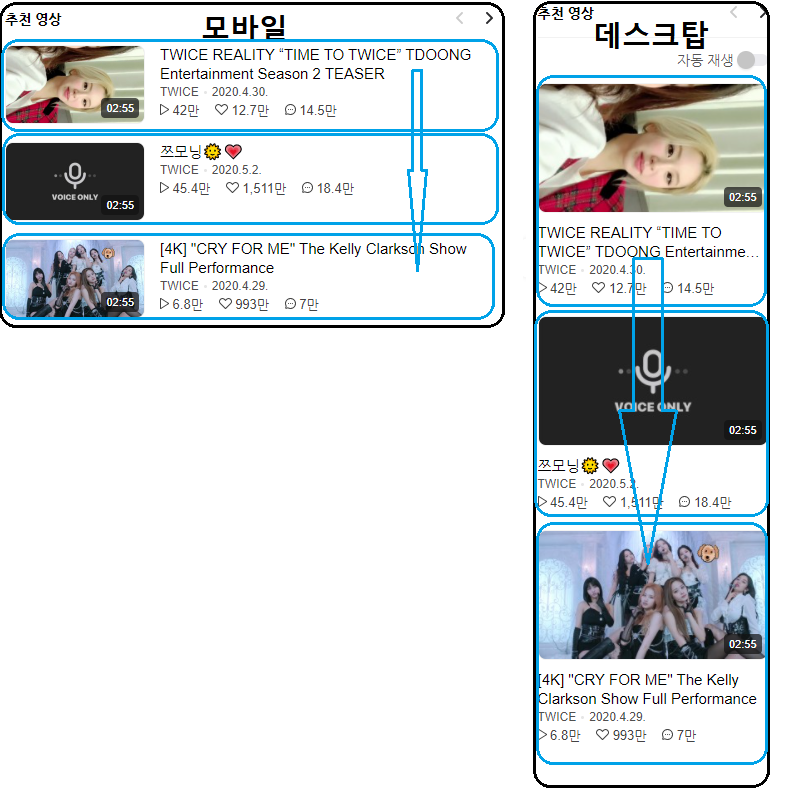
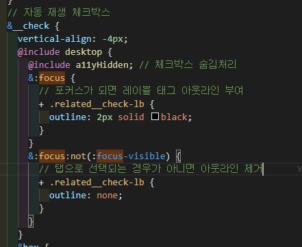

# VLIVE

## 웹표준과 접근성을 중심으로

성수동 비타민 - 김영종, 김정원, 정두영

---

# 목차

1. 개요
   1.1 기획
   1.2 개발 환경
2. VLIVE 페이지 분석
   2.1 마크업 & 스타일
   2.2 웹준과 접근성
3. 프로젝트
   3.1 마크업 구조
   3.2 결과 및 시연
4. 이슈
   4.1 접근성 이슈
   4.2
5. 결론

---

# 누구누구

---

<!-- _class: lead -->

# 추천영상 파트

### 김영종

---

# 마크업

- 디바이스의 크기에 따라 추천영상의 레이아웃이 변화되는 `적응형` 디자인 패턴을 사용됐다.

  

---

# 마크업

- 정보가 쌓이는 방향
  

---

- 논리적으로 배치 되었는가?
  - 일반적으로 리스트에 포함된 영상을 본 후에 보고싶은 영상이 없다면 다음 리스트를 보여준다.
  - 영상 정보는 제목이 가장 중요하기 때문에 제목(부가정보), 썸네일 순으로 배치

<!-- ### 기존 마크업 순서

1. 헤더
2. 버튼
3. 추천 영상 리스트

---

### 수정된 마크업 순서

1. 헤더
2. 추천 영상 리스트
3. 버튼

--- -->

---

# 스타일

1. 영상이 쌓이는 방향

- 모바일, 데스크탑: 영상이 수직 방향으로 쌓인다.
- 테블릿: 영상이 수평 방향으로 쌓인다.

2. 썸네일과 부가정보의 배치

- 테블릿, 데스크탑: 썸네일이 상단에, 부가정보는 하단에 배치된다.
- 모바일: 썸네일이 왼쪽에, 부가정보는 오른쪽에 배치된다.

3. 부가정보가 배치되는 순서

- 수직 방향으로 쌓인다.

---

> 참고: flex 속성을 사용하면 인라인, 블록 요소에 상관없이 쌓이는 흐름을 제어할 수 있다.

<!-- _class: lead -->

---

# 접근성

1. 부분 포커스 아웃라인
   기존 사이트: 자동 재생 버튼에 아웃라인이 적용되어 있지 않음
   - 접근성을 고려한다면 탭을 통해서만 포커스가 가도록 만들어야 한다.

---
